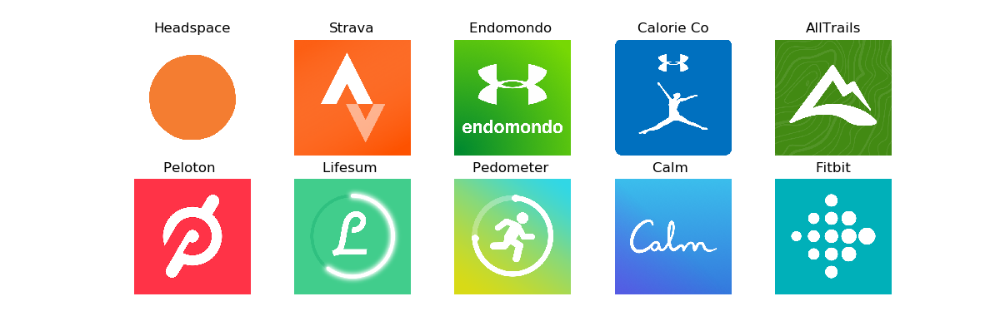
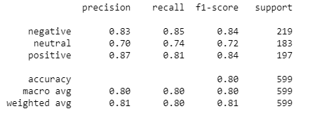
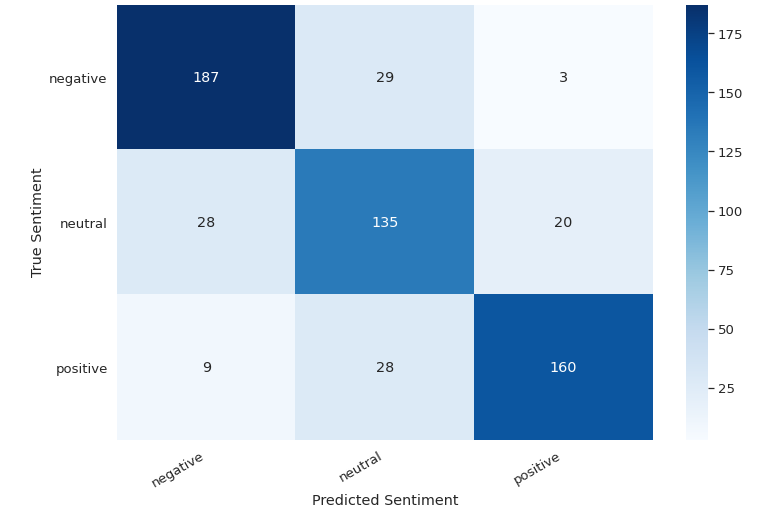

# Sentiment-Analysis-using-BERT
The objective of this project is sentiment analysis (i.e., Positive, Neutral, Negative) from the popular health and fitness app reviews. For this task, app reviews are collected from the google play store. 10 popular health and fitness apps are chosen. All around 12000 most recent reviews are collected. Ratings are considered as the measure/label of positive, negative and neutral sentiment of the reviews. The collected data are preprocessed and trained using a transformer model. Overall, 80% accuracy is achieved. 

• The data is collected using google-play-scrapper. 
• The model is trained using Pytorch.  
• For preprocessing and training the model BERT (bert-base from Hugging Face) in combination with a few dropout and dense layers are used 
• 80 % accuracy is achieved. 

# Performance

# Confusion Matrix

# Dataset 
Please check app_reviews.csv for the collected dataset. The app_info.csv file has the data on the selected apps.

# How to run
Please check scrapper.py file which has been used to fetch the reviews from google play. Also, check sentiment_analysis.ipynb for the  preprocessing and model generation steps. 

